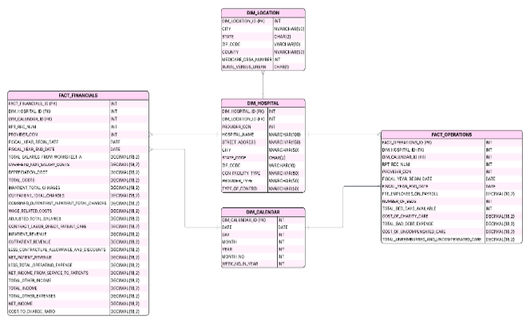

# Healthcare Data Warehouse – CMS Hospital Cost Report

## Overview
Built a healthcare analytics data warehouse using CMS Medicare Cost Report data to analyze hospital financial and operational performance. This project demonstrates ETL pipelines, data validation, dimensional modeling, and SQL analytics.

## Business Problem
Hospitals must balance financial stability with operational capacity while managing rising costs and uncompensated care. This project analyzes how financial structure and operational metrics impact hospital performance across regions and ownership types.

## Data Source
- CMS Medicare Cost Report (U.S. healthcare data)
- Public hospital financial and operational data

## Technical Implementation
- Designed star schema (fact + dimension tables)
- Built ETL pipeline from staging to warehouse
- Standardized and cleaned healthcare data
- Implemented data validation and consistency checks
- Generated analytics using SQL window functions

## Schema

## Key SQL Techniques
- ROLLUP (aggregation)
- RANK (state-level comparison)
- NTILE (quartile analysis)
- LAG (year-over-year trends)

## Key Insights
- Hospital margins are generally low across all ownership types
- Government hospitals show the highest financial strain
- Uncompensated care significantly impacts profitability
- Larger hospitals are not always more efficient

## Skills Demonstrated
- ETL pipelines
- Data quality validation
- Data warehousing
- SQL analytics
- Healthcare data analysis
- Data modeling

## Repository Structure
- `sql/` – ETL and analytics queries
- `docs/` – schema and project summary
- `images/` – visual outputs
- `data/` – sample dataset

## Why This Project Matters
This project demonstrates hands-on experience with real-world healthcare data, building analytical data systems, and generating insights—skills directly applicable to healthcare analytics and data engineering roles.
